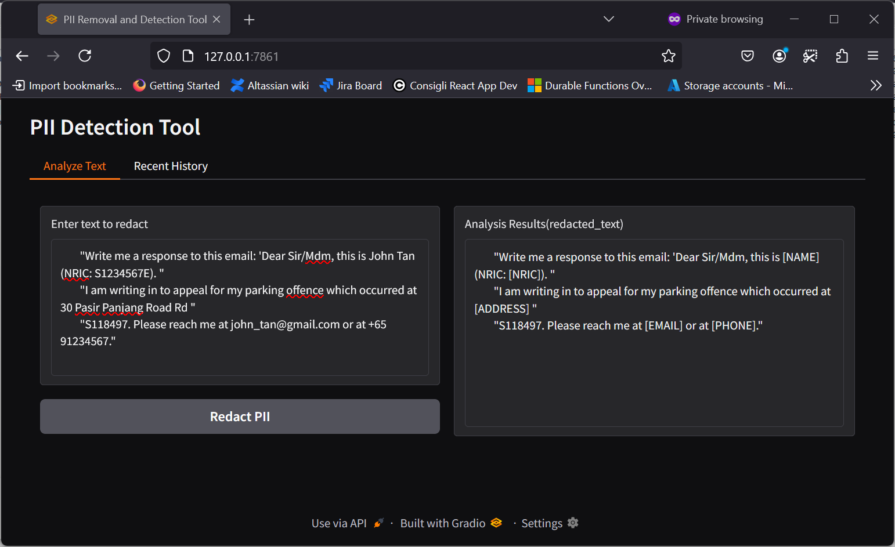
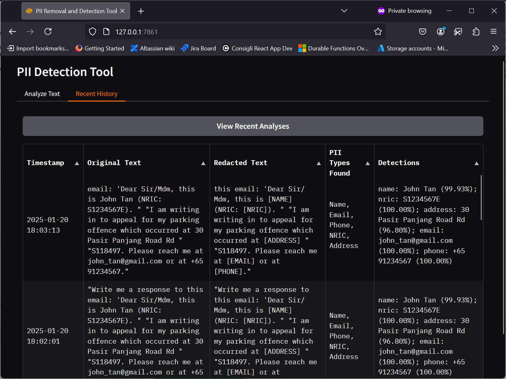

# responsibleai-exercise
Responsible AI exercise.

After most of the work is done I have noticed that this library called `[presidio](https://github.com/Microsoft/presidio)` exists. I would have probably used it if I have found this one earlier. 

However welcome,
Here are the answers 
* [section1](section1.md)
* [section2](section2.md)

And here's your preview. 
## Gradio FrontEnd

