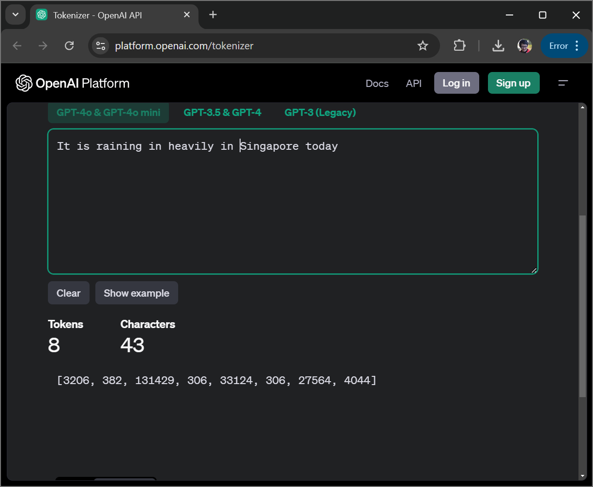
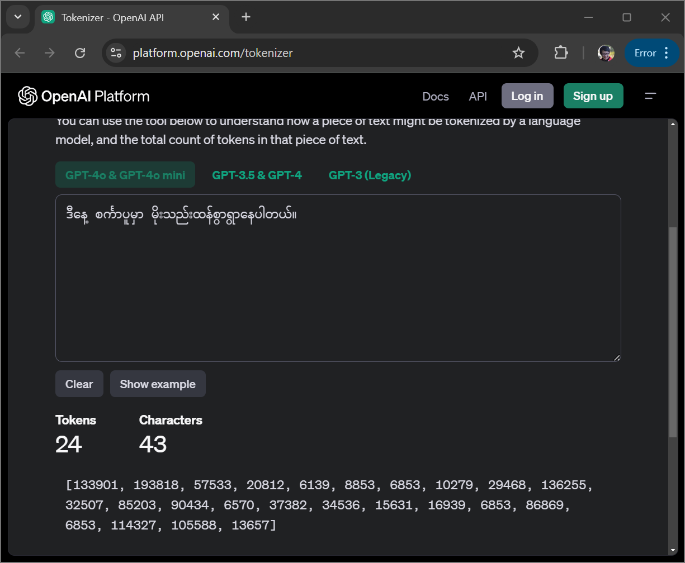

## Introduction

This document descirbes the answers to the questions regarding the paper [LionGuard: Building a Contextualized Moderation 
Classifier to Tackle Localized Unsafe Content](https://arxiv.org/abs/2407.10995). Due to the time limitation I did not read most of the literature cited in LionGuard so I might have missed or been incorrect on things.

### 1. Why are low-resource languages challenging for natural language processing and large language models? Discuss this with reference to tokenisation.

If I have to explain this to a layperson (non NLP/AI person), I would say that all current NLP/LLM approaches scales with data/compute. That is the capaiblities of the models gets better with more (quality) data and more compute usually (up to a point). For the low-resource languages, there are usually not a lot of (large enough) datasets available to train the models. Lack of both quality and quantity of training data for low-resource languages usually means that it is more difficult to train models and perform research in low-resource languages. Thus training models and performing research for low-resource languages will always be like playing a catchup game. [Interesting read](https://arxiv.org/html/2410.20817v1)

Tokenization is the process of breaking down text into smaller units known as tokens. A token can be subwords, words or characters. Tokens are usually assigned to numbers. Tokenization essential in any NLP workflows. In traditional (older non-Language Models) NLP, tokenization is usually done at word level. 

Lets imagine that you are trying to work in a high-resource language, English. We will use a popular NLP library called Spacy. Here we can see that there tokenizer for English is 100% accurate by [this documentation](https://spacy.io/models/en#en_core_web_sm-accuracy). However, if you want to work with a (medium) low-resource language like Thai, you will have to use [a plugin](https://spacy.io/universe/project/spacy-pythainlp) with potentially having ot use outdated library versions. The lack of official support tokenization for low-resource languages in modern NLP libraires makes the work more difficult. For even (very) low-resource languages like Burmese or Cambodian, they are not even mentioned on the radar of the industry's popular NLP toolkits. 

Now, lets consider how modern language models deals tokenization with tokenizing text in multiple languages. Open AI's uses [tiktoken](https://github.com/openai/tiktoken) which uses Byte-Pair Encoding (BPE). It allows efficient way to compress text and a token usually is equivalent to 4 characers in English. The encoding of text to tokens is based on the training data, more popular words in the training data is stored using less tokens to efficinetly compress text. Let's see this in action. 

We have the same text in English and Burmese that said the same thing and has the same number of characters. Note that that the Burmese language sentence is using 3x more tokens than English for the same number of characters. This token system is not as efficient with non English and especially non latin low-resource languages. What is the consequence? Everything from the context window (capacity) of the LLM to the performance and costs are measured in tokens. If a language is usually encoded in longer token lengths it is more expensive.

### 2. What implications does this paper have for the development of safety guardrails for LLMs in countries with low-resource languages?

The paper showed that the generic, English in western context trained, guardrail models perform poorly on low-resource language, in particular Singlish, an English creole. The paper also emphasized the importance of considering local context for content moderation. For instance, the category 'public harm' is usually missing in western-authored categories of unsafe content but it is added as a sperate context for LionGuard. That is probably due to differences in local values, culture and regulations.

The paper also hilighted that with local context, the right knowledge from the smart people, it is possible to develop a siginificantly better guardrail for a low-resource language without requiring a lot of data labelling and computational resources. The paper described a method of using prompting and multiple LLMs to efficiently label a large number of text. The comparisions of prompting techniques and the usage of consensus between LLMs were used to ensure the label quality in the generated dataset. This is significant because in low-resources languages, the training data is scarce and even with the funding the infrastructure to get humans to label your data is not readily available. 

Finally, the paper showed that one can build a content moderation model for that performs significantly better for the local context without requiring a large budget for labelling and computational resources.

### 3. Why was PR-AUC used as the evaluation metric for LionGuard over other performance metrics? In what situations would a F1-score be preferable? 

The choice of evaluation metric depends on the balance of dataset and the goal of the model. In the LionGuard(Foo and Khoo, 2024) paper, the dataset consists of a much lower percentage of positive labels, 6.15% for unsafe labels and 0.06% for self-harm. As a bad measure would be, for example, using accuracy measure. For a classifier that always output 'safe content' will result in 93% accuracy as 93% of the samples are safe. For these reasons, F1-score or PR-AUC are usually used with imbalanced datasets. 

When it comes to a guardrails model, it is necessary to consider the threadshold of the score where the label should be considered a positive label or negative label. This is because the threadshold may be adjusted based on the how sensitive of a guardrails is necessary. Therefore, PR-AUC measure is more relevant as it evaluates precision and recall tradeoff across all thredsholds and more indiciative of the model's performance across all thredsholds. 

F1-score would be preferable if there is not a need to consider the model's performance curve across all thredshold. If the main purpose of the model is to give binary labels, then F1 score is better as it is a more easily interpretable score together with precision and recall.

### 4. What are some weaknesses in LionGuard’s methodology? 

Note: These arguments are made with regard to LionGuard the paper. As a tool for content moderation in Singlish it is a really promising tool with the modely openly available on Hugging face. 

Please excuse me as I will go into a conference's reviewer mode. 

I have worked with subjective judements as well and it is very difficult to correctly reach a consistency even among humans regarding whether a text should be considered safe or unsafe. It is very contextual as there are jokes safe to say to your friends while you wont say those jokes at work. 

First of all, for the initial 200 samples of expert labelled dataset. It is probably quite a small dataset for 7 categories. In addition, the term expert-labelled dataset should be quantified as there might be people who do the content moderation as their profession and considered experts in content moderation. The crowdsourcing experitment also revealed that the it is very hard to reach consensus by (non-expert) humans on the most important category "unsafe" with only 52.9% aggrement. It is impossible to get rid of subjecitve bias completely. However, it will be useful to elaborate more on these issues and identify potential methods to mitigate them.

It would also be interesting to understand the societal and legal context for adding the category "public harm", as well as, how the definitions of safe and unsafe differs between your dataset and publicly available datasets/models. In a related note, it would be also interesting to see in the literature about crowdsourcing and anchoring effect. If the crowd sourced users were to do a small calibration quiz before labelling, would it lead to more consensus between them and the LLM prompt generated labels. 

And one other limitation of the applicability of the paper in general for other low-resources languages is that the heavy lifting of the LionGuard model seems to be coming from the embedding model as all the classifiers produces similar results given the same embedding model. The embedding models will not work just as well for actual non-English/non-Latin based low-resource languages. Though the technique is applicable for local contextualized content moderation, it wont necessarily apply to low-resource language approaches where the language is not a creole language of a high-resource language.  

### Improvements

As a technical paper, the current state of the paper does a very good job of describing the process of building LionGuard. As a academic paper however, it will be more intestersting to emphasize on how the first two contributions of the paper and dive deep into how the authors came up with their own cateogries. For instance, local values and regulatory frameworks can be elaborated. The IMDA codes in comparison with the regulations used in other papers might be able to illustrate the resulting differences in categories.
