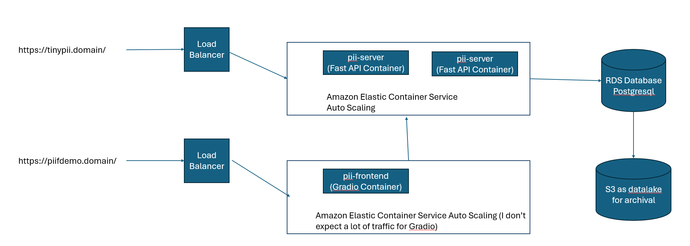

# TinyPII GuardRail

The code consists of three seperate and loosely coupled components. 
* tiny-pii - the library that scrapes the personal identifiable information. It uses `dslim/bert-base-NER` model from hugging face to perform name and detection. It also contains a pipeline model where other NER models can easily be plugged in into the workflow. It also has the script for running on the CSV file. And it has tests!
* pii-server - FastAPI wrapper on on the tiny-pii that exposes two endpoints `/process` and `/history`. Also stores the results in the database.
* pii-frontend - Gradio frontend that only uses pii-server to use PII serice and also view the history. I intentionally avoided this from using the database directly for the sake of cleaner architecture.

I have dockerized all my components. However, if you want to run them manually [get poetry](https://python-poetry.org/docs/#installation). I have used it since I found it useful to manage python issues with dependency management.

## Tiny-PII 

A POC PII compoment that identifies and scraps out the personal identifiable information from the text.

Currently it detects and removes the following.
* names
* emails    
* phone numbers
* NRICs
* addresses 

Note: uses torch cpu version to make installation faster/easier. And to keep it "tiny".

### Thoughts process for Tiny-pII

For simplest route, I could have used Spacy and it will lead to pretty nice results. Spacy has NER and it has entity classes for Names and Addresses. As for the email, phone number and NRICs regular expressions should do a decent job. As a bonus I have been using Spacy in production over three years so its realiable.

But to make it more intersting, I tried to find a dataset and opensource model on Huggingface. If I have a lot of time to work on this project I would defnitely look into open source dataset for PII such as [pii-masking-300k](https://huggingface.co/datasets/ai4privacy/pii-masking-300k) and [the The Learning Agency Lab - PII Data Detection](https://www.kaggle.com/competitions/pii-detection-removal-from-educational-data/leaderboard) datasets. These can be used to fine-tune Llama or Bert models. However, I can only really work on this test on the weekends so I ended up using with a generic decent NER model.

I will use [dslim/bert-base-NER](https://huggingface.co/dslim/bert-base-NER) model to detect person names and location. The model card does not specify the evaluation results per category (Person and Location) but it is f1 91.3, precision 90.7 and recall 91.9 on the test set which is decent. 

### Tiny-PII Implemtation
`dslim/bert-base-NER` will be used to detect person names and locations. Through testing I have noticed that it does not tag post codes as location. Therefore, postcodes will be detected as a part of addresses using regular expressions. Regular expressions are more appropirate than train models for detecting patterns that can be specificed using regular expression as they are 100% accurate if the pattern matches. In summary the detection method are as follows.

* names - NER class: PER
* emails - Regex
* phone numbers - Regex 
* NRICs - Regex
* addresses - LOC and regex for post codes.

For the implementation steps, I will start by something I have found works great for data intensive applications that is defining the types first. I will use Pydantic for this as it is pretty much industry standard at this point.

The input to the API/method will be just text. The output will be an instance of pydantic class called `TinyPIIOutput` that has the following fields 
* text - The original text
* name - 1 or 0
* email - 1 or 0
* phone - 1 or 0
* nric - 1 or 0
* address - 1 or 0
* detections - list[TinyPIIDetection]
* redacted_text - Text with PII masked. 

The class `TinyPIIDetection` has the following fields
* detected class - Enum of 'TinyPIICategories' (name, email, phone, nric, address, location, )
* text - string
* confidence - float 0.0 to 1.0 
* position - (int,int)
* detector 0 Enum of 'TinyPIIDetectors' (HuggingFaceBertDetector, RegexDetector)

After that the flow of the logic of the detection
* Run HiggingFaceBertDetector (input text, output TinyPIIDetection)
* Run RegexDetector (input text, output TinyPIIDetection)
* Produce the TinyPIIOutput by aggregating these results 
* Clean up overlapping segments and when they do use the longer detection to protect more personal information than less.
* Convert these results to the requested CSV file output. 


### Running the script 
`poetry run python tiny_pii/scripts/process_csv1.py data/pii_data.csv --output_file data/pii_data_redacted.csv`

The output csv file is here [tiny-pii/data/pii_data_redacted.csv](tiny-pii/data/pii_data_redacted.csv)

## Evauation 
Since, this PII can be treated as a named entity recognition (NER) detection challenge for each category, it is appropirate to use F1-score for the evaluation. Also including precision and recall next to F1-score will add useful metrics to evaluate the performance and do necessary adjustments. 

There are other evaluation methods proposed which addresses downsides with using F1, precision and recall. For instance, [Interpretable Multi-dataset Evaluation for Named Entity Recognition](https://arxiv.org/abs/2011.06854). However, I would still stick to F1-score, precision and recall since they are widely adopted in the industry and easier to compute in existing workflows. 


## AWS Deployment



The front end and the API will run on their own containers. Only the API will have access to the database. I have also considered using S3 as a datalake when the historical data gets too large to save storage costs. I have not done a cost comparison yet for Azure. From my experience with Azure, specialized services such as ML inference are more expensive than containers. This explains the reasoning behind using containers other than AWS's SageMaker. Also containers gives us full control of the execution environment (at the expense of having to manage it)

For the deployment, I will utilize IaC for defining all required AWS resources in Terraform.

## Improvements

I have noticed that the name detection does not work well for Singaporean names and thus fragments of names such as 'Ah' are being not detected by the NER model properly as a part of a person's names. This again comes down to being low-resource language. 

If I have more time, I would look into the building my own training data for the Singaporean context and then fine-tune existing BERT models based on the training data. It might be intresting to also compare the performances of BERT models with LLMs such as llama.

The code organization could use some work as well. The code is obviously not in a single folder but please copy the three folders pii-frontend, pii-server and tiny-pii. I notice the text but it is a bit too late to reorganize everything.

## Running the code

Running with docker 

cd into the folder where pii-server/docker-compose.yml file is


```
cd pii-server
docker-compose up --build
```

```
docker-compose down
```


How to use the API
```
curl -X POST \
  -H "Content-Type: application/json" \
  -d '{"text": "Hello, my name is Than Htut Soe, email is thanhtutsoetgi@gmail.com!"}' \
  http://localhost:8000/process
```
Response
```
{"redacted_text":"Hello, my name is [NAME], email is [EMAIL]!","status":"success"}
```

To get the history records in JSON
```
curl -X GET http://localhost:8000/history
curl -X GET http://localhost:8000/history?skip=100&limit=50 
```
Response
```
[
  {
    "text": "Hello, my name is Than Htut Soe, email is thanhtutsoetgi@gmail.com!",
    "name": 1,
    "email": 1,
    "phone": 0,
    "nric": 0,
    "address": 0,
    "detections": [
      {
        "detected_class": "name",
        "text": "Than Htut Soe",
        "confidence": 0.8482694625854492,
        "position": [
          18,
          31
        ],
        "detector": "HuggingFaceBertDetector"
      },
      {
        "detected_class": "email",
        "text": "thanhtutsoetgi@gmail.com",
        "confidence": 1,
        "position": [
          42,
          66
        ],
        "detector": "RegexDetector"
      }
    ],
    "redacted_text": "Hello, my name is [NAME], email is [EMAIL]!",
    "created_at": "2025-01-20T16:49:03.157547"
  },
  {
    "text": "Hello, my name is Than Htut Soe, email is thanhtutsoetgi@gmail.com!",
    "name": 1,
    "email": 1,
    "phone": 0,
    "nric": 0,
    "address": 0,
    "detections": [
      {
        "detected_class": "name",
        "text": "Than Htut Soe",
        "confidence": 0.8482694625854492,
        "position": [
          18,
          31
        ],
        "detector": "HuggingFaceBertDetector"
      },
      {
        "detected_class": "email",
        "text": "thanhtutsoetgi@gmail.com",
        "confidence": 1,
        "position": [
          42,
          66
        ],
        "detector": "RegexDetector"
      }
    ],
    "redacted_text": "Hello, my name is [NAME], email is [EMAIL]!",
    "created_at": "2025-01-20T16:49:00.207587"
  },
  {
    "text": "Hello, my name is Than Htut Soe, email is thanhtutsoetgi@gmail.com!",
    "name": 1,
    "email": 1,
    "phone": 0,
    "nric": 0,
    "address": 0,
    "detections": [
      {
        "detected_class": "name",
        "text": "Than Htut Soe",
        "confidence": 0.8482694625854492,
        "position": [
          18,
          31
        ],
        "detector": "HuggingFaceBertDetector"
      },
      {
        "detected_class": "email",
        "text": "thanhtutsoetgi@gmail.com",
        "confidence": 1,
        "position": [
          42,
          66
        ],
        "detector": "RegexDetector"
      }
    ],
    "redacted_text": "Hello, my name is [NAME], email is [EMAIL]!",
    "created_at": "2025-01-20T16:48:58.554829"
  },
]
```
The gradio URL is at:
http://localhost:7860/

### Running with poetry 
Each component has README.md file for help with this as well.

* Install Poetry
* cd `cd pii-server/`
* Install dependicines with "poetry install"
* Run the server `poetry run uvicorn main:app --host 0.0.0.0 --port 8000`

Also the tiny-pii library has tests!. To run them `cd tiny-pii` and `poetry run pytest tests`.

Reach out to thanhtutsoetgi@gmail.com if there's any troubles with running.